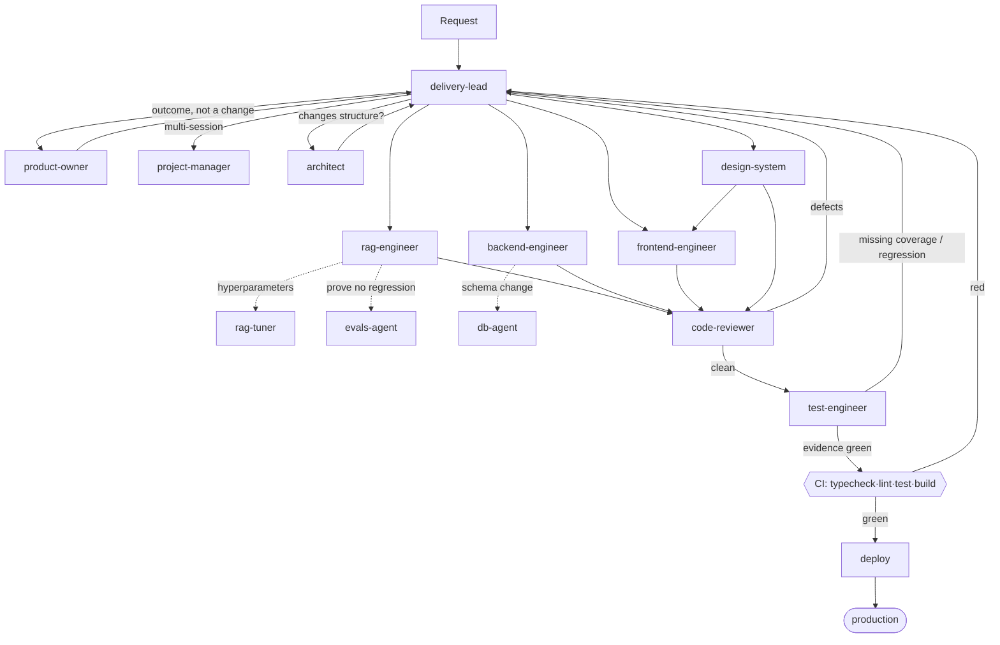

# Agent team — routing and handoff protocol

Project-scoped agents for the Compliance Research Agent. Claude Code loads every `.md` in
this directory automatically; invoke one with `@agent-name` or let `delivery-lead` route.

These are **project agents** — they know this codebase's files, invariants and failure
modes. For generic deep expertise (a11y audits, security review, SQL tuning) there are
~147 general agents installed at `~/.claude/agents/`; the specialists below say when to
reach for them.

## The team

| Agent | Owns | Invoke when |
|---|---|---|
| `delivery-lead` | routing, sequencing, quality gate | you don't know who owns it, or work spans specialisms |
| `product-owner` | specs, acceptance criteria, scope | the request is an outcome, not a change |
| `project-manager` | task state, blockers, status | multi-session work; you need an honest status |
| `architect` | structure, dependencies, boundaries | new dependency, pipeline reorder, new state |
| `rag-engineer` | `lib/ai/**`, `lib/chunking/**` | chunking, retrieval, RRF, rerank, graph, prompts |
| `backend-engineer` | `app/api/**`, `app/actions/**`, `lib/inngest/**`, `lib/supabase/**`, CI | routes, actions, jobs, DB access, deployment |
| `frontend-engineer` | `components/**`, pages | chat UI, inspector, streaming, panels |
| `design-system` | `app/globals.css`, `components/ui/**` | new visual pattern, tokens, primitives |
| `code-reviewer` | correctness by inspection | after code is written, before tests |
| `test-engineer` | `tests/**`, `evals/**` | after review, before CI — produces the evidence |

Three older single-purpose prompts remain in `prompts/dev-agents/` and are still the
authority in their niche: `db-agent.md` (SQL/pgvector), `evals-agent.md` (RAG metrics),
`rag-tuner.md` (hyperparameters).

## Routing



## The verification order

**`code-reviewer` → `test-engineer` → CI → deploy.** Each stage answers a different
question, and running them out of order wastes the expensive ones:

1. **Review** — is it correct *by inspection*? Catches silent-regression patterns a test
   would never think to look for (a removed `dedupeByParent`, a threshold applied to
   passthrough zeros).
2. **Test** — is it correct *by execution*? Produces the evidence: unit tests for pure
   logic, eval numbers for anything touching retrieval.
3. **CI** — does that evidence hold on a clean machine? Catches "works on my node_modules".
4. **Deploy** — gated on CI. A red suite cannot reach production.

Review before test is deliberate: a reviewer who finds a design flaw saves you writing
tests for code that is about to be rewritten.

## Handoff contract

Every handoff carries these four things. Anything less and the receiving agent is guessing.

```
Task:      what to change, in one sentence
Files:     the paths in scope — from the ownership map, not a guess
Done when: observable criteria (a metric, a state, a passing command)
Context:   the constraint that is not obvious from reading the code
```

## Mandatory review

`code-reviewer` is **not optional** when a change touches:

- `lib/ai/retrieval/**` — pipeline order, fusion, thresholds
- `lib/ai/agent/state.ts` — reducers decide what the model reads
- `lib/ai/agent/prompts.ts` — the citation contract spans three prompts
- anything crossing the server/client boundary

Rationale: failures in these paths are **silent**. They surface as worse answers, not as
exceptions, so no test or build will catch them.

## Escalation

- Engineer → `architect`: a fix would need a new dependency, a pipeline reorder, or a
  second source of truth for state.
- Engineer → `product-owner`: the spec's acceptance criteria are not checkable.
- Anyone → `delivery-lead`: two agents appear to own the same change (the change is too
  big — split it).
- `rag-engineer` → `test-engineer`: **always**, before merging a retrieval change. Numbers
  or it did not happen.
- `test-engineer` → `delivery-lead`: coverage gap or metric regression — the change goes
  back to its owner, it does not proceed to CI.

## Definition of done — same for everyone

```bash
pnpm typecheck && pnpm lint && pnpm test
```

Plus, by change type:

| Change | Additional gate |
|---|---|
| Retrieval / chunking | `pnpm evals` before/after, both configs reported; no metric regression |
| UI | seen working in a browser, streaming path included |
| Ingestion | a real file uploaded and reaching `ready` |
| Schema | migration is idempotent; states whether it locks a table |

A passing build is not evidence that the feature works. It is evidence that it compiles.
